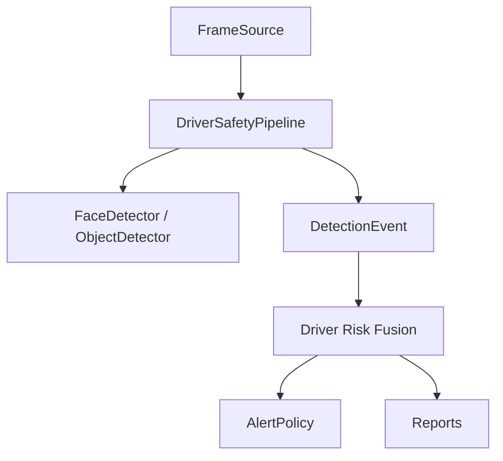

# Architecture

AI Driver Safety is organized around one practical path: turn cabin video and optional sensor data into a driver-risk timeline.

## Components

- `driver_safety.core`: typed events, driver states, risk scoring, smoothing, alert cooldowns.
- `driver_safety.vision`: detector interfaces, MediaPipe adapter, Haar fallback, signal metrics, optional ONNX object detection.
- `driver_safety.io`: video/webcam sources and annotated overlay writer.
- `driver_safety.runtime`: video and webcam loops.
- `driver_safety.reporting`: JSON, CSV, and HTML exports.

## Detector Strategy

The runtime depends on interfaces instead of one model implementation:

- `FaceLandmarkDetector.detect(frame) -> FaceObservation[]`
- `ObjectDetector.detect(frame) -> ObjectObservation[]`

The default config uses `vision.provider: auto`, which attempts MediaPipe Face Landmarker when the model is present, then falls back to OpenCV Haar face detection for basic face presence.

## Event Model

Each event includes:

- timestamp
- frame index
- signal
- state
- score
- severity
- message
- optional bbox and landmarks
- metadata

## Driver Risk Fusion

The scorer is `driver-risk-fusion-v1`. It does three things:

1. Converts each signal into evidence in the `0..1` range.
2. Combines evidence with a noisy-OR fusion rule so multiple weak signals can raise risk without simple addition.
3. Applies explicit cross-signal boosts when the combination matters: eye closure plus yawning, visual fatigue plus physiological fatigue, visual fatigue plus vehicle risk, or distraction plus short time-to-collision.

That keeps the original fuzzy-logic idea practical: the system can explain why risk went up, and every event remains visible in `events.json`.
